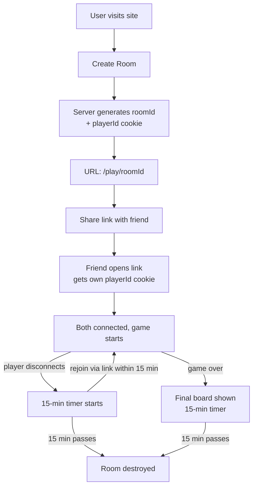
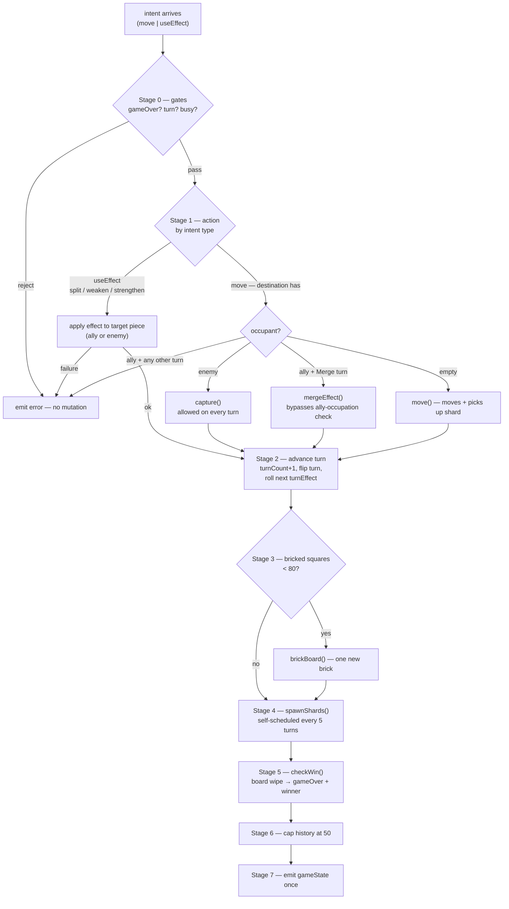

# Number Wars — Architecture & Implementation Plan

## 1. Overview

A real-time, browser-based strategy game. No accounts, no database. Players
visit the site, create a room, and either share a link to invite a friend,
play against a computer algorithm, or play against an LLM.

**Core principles:**

- **No database.** All game state lives in server memory. The server is the
  single source of truth; clients are dumb renderers.
- **Server-authoritative.** Clients send *intents* (moves). The server
  validates, mutates the in-memory `gameState`, and broadcasts the result.
- **Room link = identity.** Whoever has the URL is a player. A `playerId`
  cookie persists identity across disconnects.
- **Hybrid threading.** The main thread owns rooms and all game logic.
  Worker threads are a *compute pool* used only for CPU-bound computer
  algorithm searches.

## 2. Tech Stack

| Layer | Choice |
|---|---|
| Frontend | Static site (rules page + game page), deployed on **Vercel** |
| Backend | Node.js + TypeScript + Socket.IO, deployed on **Railway** |
| Threading | `worker_threads` (4 workers, compute pool) |
| Database | **None** |
| AI opponent | LLM API call (async network I/O, from main thread) |
| Computer opponent | Local algorithm (minimax/MCTS — CPU-bound, runs in a worker) |

## 3. High-Level Architecture (Hybrid)

```mermaid
flowchart LR
    subgraph Main Thread (owns rooms + game logic)
        IO[Socket.IO server]
        ROOMS[rooms Map<br/>gameState for every room]
        TIMERS[roomTimers Map<br/>15-min disconnect timers]
        COOKIES[playerId cookies]
    end

    subgraph Worker Pool (compute only)
        W1[Worker 1<br/>algorithm search]
        W2[Worker 2<br/>algorithm search]
        W3[Worker 3<br/>algorithm search]
        W4[Worker 4<br/>algorithm search]
    end

    C1[Client A] -->|move intent| IO
    C2[Client B] -->|move intent| IO
    IO --> ROOMS
    ROOMS -->|state in, move out<br/>only on AI turns| W2
    W2 -->|computed move| ROOMS
    ROOMS -->|io.to(roomId).emit gameState| IO
    IO --> C1
    IO --> C2
```

**Division of labor:**

- **Main thread** — owns Socket.IO, the `rooms` Map, all game logic for
  human and LLM moves, cookies, and the 15-minute timers. Never blocked by
  CPU-heavy work.
- **Workers** — a stateless compute pool. They hold **no rooms**. On a
  computer-algorithm turn, the main thread sends the serialized `gameState`
  to a free worker, the worker runs the search, and returns the chosen move.
  Any worker can serve any room (no consistent hashing needed).

### Why hybrid (vs. pure worker ownership)

| Aspect | Worker ownership | Hybrid (chosen) |
|---|---|---|
| Human move latency | +100–400 µs (2 structured clones per move) | Zero overhead — logic stays on main thread |
| Algorithm mode | Isolated on a core | Isolated on a core (same benefit) |
| Complexity | Consistent hashing, pending map for every message | Pending map only for AI-turn requests |
| Memory | Per-worker heaps (4× overhead) | Single heap |
| Worker crash | Loses owned rooms | Loses nothing — workers are stateless |

The hybrid gets the multi-core benefit where it matters (algorithm searches)
without taxing the common path (human/LLM moves).

## 4. Thread Model

### 4.1 Worker pool (stateless)

```ts
// main.ts
const workers = Array.from(
  { length: 4 },
  () => new Worker(path.join(__dirname, "search-worker.js"))
);

// Round-robin: hand each search to the next free worker
let nextWorker = 0;
function getFreeWorker(): Worker {
  return workers[nextWorker++ % workers.length]!;
}
```

### 4.2 Request/response correlation (AI turns only)

```ts
const pending = new Map<number, { roomId: string }>();
let nextMsgId = 1;

function requestAiMove(roomId: string, state: gameState): Promise<AiMove> {
  const id = nextMsgId++;
  const worker = getFreeWorker();
  return new Promise((resolve, reject) => {
    pending.set(id, { roomId });
    worker.postMessage({ id, state });
    // resolve/reject happens in worker.on("message")
  });
}
```

### 4.3 Worker message protocol

```ts
// Main → Worker
{ id, state: gameState }                    // full state, search it

// Worker → Main
{ id, move: { pieceId, destination } }      // the chosen move
{ id, error: string }                       // search failed
```

Workers are **stateless** — they receive a state, return a move, done. No
rooms, no hashing, no crash-recovery problem.

## 5. Room Lifecycle



### 5.1 Room data structure (main thread memory)

```ts
type Room = {
  roomId: string;
  state: gameState;                 // from assets/start.ts
  players: PlayerSlot[];            // max 2
  mode: "friend" | "ai" | "computer";
  host: string;                     // playerId
  createdAt: number;
};

type PlayerSlot = {
  playerId: string;                 // stable identity (cookie)
  socketId: string;                 // current connection (changes on reconnect)
  affiliation: "red" | "blue";
  connected: boolean;
};

const rooms = new Map<string, Room>();
const roomTimers = new Map<string, NodeJS.Timeout>();
```

### 5.2 Create room

1. Client emits `createRoom { mode }`.
2. Server generates `roomId` (6 chars base36), assigns the host a `playerId`
   (`crypto.randomUUID()`), sets the `playerId` cookie.
3. Server builds a fresh `gameState` via the refactored `startGame()` (see §9).
4. Server returns `{ roomId, link: "/play/roomId" }` to the host.
5. Client updates the URL via `history.pushState` and shows a
   copy-invite-link button.

### 5.3 Join via link

1. Friend opens `/play/roomId`; client emits `joinRoom { roomId }`.
2. Server reads the friend's `playerId` cookie (or issues a new one).
3. Server assigns the friend the open seat (`blue` if host is `red`).
4. Server broadcasts `gameState` to the whole room so both see the board.

### 5.4 Playing

1. Client emits an intent — either a `move` or a `useEffect` (§5.5).
2. The server runs the full **turn pipeline** (§5.5) — gate checks, action
   resolution, turn advancement, bricking, shard spawns, win check — all
   synchronously on the main thread, ending in a single `gameState` broadcast.
3. Clients re-render the board from the received state. **Clients never
   mutate state locally.**

### 5.5 The turn pipeline (main thread)

`handleIntent(room, playerId, intent)` in `server/main.ts` is the **only
place game state mutates**. Human moves (§7.1), bot moves (§7.2), and LLM
moves (§7.3) all feed into it — the bot workers and the LLM return
*intents*, and the pipeline applies them exactly like a human move. Never
mutate `state` anywhere else.

**Stage order is fixed.** All stages run synchronously before any broadcast:



**Stage 0 — gate checks.** Reject without mutating anything:
`gameOver` → "Game is over"; player's affiliation ≠ `state.turn` → "Not
your turn"; room marked `thinking` (AI move in flight, §7.3) →
"Opponent is thinking".

**Stage 1 — resolve the action.**

| Intent | Server behaviour |
|---|---|
| `useEffect` `{ effect: "split"\|"weaken"\|"strengthen", targetId }` | Find the target piece and call `splitEffect` / `weakenEffect` / `strengthenPiece`. Effects are affiliation-agnostic (Weaken/Strengthen hit allies *or* enemies); Split requires your own piece. On success, push `gameHistory` `Used {effect} on {target}` (the effect fns don't log) and let Stage 2 advance the turn. On failure ("Piece is invulnerable", "Piece cannot be split", …) emit the error — **the turn is not consumed**. |
| `move` → destination empty | Plain move / shard pickup via `move()`. Picks up armor/spike shards, applies spike caps. |
| `move` → destination has an enemy | `capture()` — legal on **every** turn, regardless of `turnEffect`. |
| `move` → destination has an ally | Only legal when `state.turnEffect === "Merge"`; calls `mergeEffect()` (module-private today — must be exported, see §9.4). This **bypasses** `validateMove`'s "occupied by an ally piece" rejection; `mergeEffect` does its own range/path checks. Any non-Merge turn → reject. |
| `move` → anything, on Split/Weaken/Strengthen turns | The player may **ignore the operation** and just reposition — always allowed. |

**Stage 2 — advance the turn.** `move()`/`capture()` already bump
`turnCount` and flip `state.turn`. `mergeEffect`, `splitEffect`,
`weakenEffect`, and `strengthenPiece` do **not** — for those, the pipeline
performs the same step here, **after** the action resolves (the effect fns
check `game.turn` for ownership, so the flip must not happen early). The
last step of every turn rolls the next player's effect via
`chooseTurnEffect()` into `state.turnEffect`. For the very first turn
(blue, turn 0) the roll happens at game start —
`createInitialGameState` leaves a placeholder `"Merge"` that the server
must replace.

**Stage 3 — bricking (every turn).** Call `brickBoard(state)` on every turn
— **it no-ops until turn 20** (`BRICK_START_TURN`) and until 80 squares are
bricked (`MAX_BRICKS`), so no turn check is needed at the call site. When
active, it bricks one more random non-bricked square and keeps
`state.bricks` in sync. One brick per turn — the board shrinks slowly over
the match (§6 of the ruleset).

**Stage 4 — shard spawns (every turn, self-scheduled).** Call
`spawnShards(state)` unconditionally. It only acts on turns where
`turnCount ≥ shardTurn` (every 5th completed turn), catches up skipped
turns via its internal `while` loop, stops after `maxShardSpawns` (10),
and skips a spawn when 10+ shards are already on the board.

**Stage 5 — win check.** If `bluePieces.length === 0` → red wins; if
`redPieces.length === 0` → blue wins. Set `gameOver = true` and
`gameWinner`. If elimination is mathematically impossible (pieces can
never reach each other), fall back to the capture-points tiebreaker (§9
of the ruleset).

**Stage 6 — cap history.** Shift the oldest entries so
`gameHistory.length ≤ 50` (§9.2).

**Stage 7 — broadcast.** `io.to(roomId).emit("gameState", state)` —
exactly one emit per turn, after every mutation. No client ever sees
intermediate state.

Intent schemas:

```ts
// client → server
{ type: "move", roomId, pieceId, destination }                  // move / capture / merge / shard pickup
{ type: "useEffect", roomId, effect: "split" | "weaken" | "strengthen", targetId }

// bot worker (§4.3) and LLM (§7.3) return { pieceId, destination };
// the server wraps that as a "move" intent and runs it through this same pipeline.
```

Because `state.turnEffect` ships inside every `gameState`, clients can
render the right UI for the current turn automatically: a Merge banner
with an implicit hint, or activation buttons for Split/Weaken/Strengthen.

## 6. Identity (Cookie)

- On first create/join, the server sets `playerId=<uuid>; Path=/; Max-Age=86400`.
- The cookie is sent automatically on every Socket.IO handshake, so reconnects
  carry the same identity.
- `room.players` stores `{ playerId, socketId, affiliation }`. On rejoin, the
  server matches by `playerId` and **rebinds** `socketId` to the new socket.
- Identity is tied to the browser. Anyone on the same browser *is* that
  player — acceptable for a casual game (the link is already the password).

### 6.1 Reconnect handling

- **Network blip / laptop sleep:** Socket.IO `connectionStateRecovery`
  (15-min window) restores rooms and missed events with zero code.
- **Tab closed / browser restart:** the `playerId` cookie survives; reopening
  the link rejoins the room and the server sends the current `gameState` —
  the player resumes exactly where they left off.

```ts
const io = new Server(3000, {
  connectionStateRecovery: {
    maxDisconnectionDuration: 15 * 60 * 1000,
    skipMiddlewares: true,
  },
});
```

## 7. The Three Modes

### 7.1 Play with friend (link)

Two human players, two sockets, one room. Moves run on the main thread (§5.4).

### 7.2 Play vs computer algorithm

- Room has one human + one bot slot. The bot's seat is a `PlayerSlot` with
  `socketId: null`.
- When it's the bot's turn, the main thread serializes the `gameState`,
  sends it to a free worker, and awaits the computed move (see §4.2).
- The worker runs minimax/MCTS **on its own core** — the main thread stays
  responsive for all other games.
- The computed move is wrapped as a `move` intent and fed through the exact
  same turn pipeline as a human move (§5.5) — bricking, shard spawns, and
  the win check run identically. The human sees the bot "think" via a small
  artificial delay.

### 7.3 Play vs LLM

- Room has one human + one AI slot.
- When it's the AI's turn, the main thread makes the async LLM API call
  (network I/O — does not block the event loop).
- The LLM returns `{ pieceId, destination }`; the main thread wraps it as a
  `move` intent with the AI's playerId and runs it through the turn pipeline
  (§5.5).
- **Ordering caveat:** while the LLM call is in flight, the room is marked
  "AI thinking" — human moves for that room are queued or rejected until the
  AI move resolves.

## 8. Disconnect & Cleanup (15-minute rule)

- **Timer starts only on disconnect** (or game over). Moves never reset it.
- **Rejoin cancels it.** If the timer is running and a player rejoins, the
  room lives on.
- **Timer fires → room destroyed:** `rooms.delete`, sockets leave the room,
  any pending timers cleared.

```ts
socket.on("disconnect", () => {
  for (const [roomId, room] of rooms) {
    const slot = room.players.find(p => p.socketId === socket.id);
    if (slot) {
      slot.connected = false;
      if (!roomTimers.has(roomId)) {
        roomTimers.set(roomId, setTimeout(() => destroyRoom(roomId), 15 * 60 * 1000));
      }
      io.to(roomId).emit("playerDisconnected");
    }
  }
});
```

- **Server restart:** all rooms are lost (no DB). Players create new rooms.
  Accepted trade-off.
- **Worker crash:** harmless — workers are stateless. Respawn and continue.

## 9. Required Refactors to Existing Code

### 9.1 `startGame()` leaks pieces across games (MUST FIX)

`assets/start.ts` uses module-level `redPieces`/`bluePieces` arrays that are
mutated on every call. Two rooms would share piece objects and corrupt each
other. Fix: build fresh arrays per game.

```ts
// assets/start.ts — refactored
function createSide(
  side: number[],
  board: Board,
  columns: number[],
  affiliation: Affiliation,
  redPieces: Piece[],
  bluePieces: Piece[]
) {
  // ... same logic, but pushes into the passed-in arrays
}

export default function startGame(): gameState {
  const board = createEmptyBoard(columns, rows);
  const redPieces: Piece[] = [];
  const bluePieces: Piece[] = [];

  createSide(redSide, board, columns, "red", redPieces, bluePieces);
  createSide(blueSide, board, columns, "blue", redPieces, bluePieces);

  return createInitialGameState(board, redPieces, bluePieces);
}
```

`createInitialGameState` must also accept the arrays as parameters instead of
reading module-level state.

### 9.2 `gameHistory` grows unboundedly (cap at 50)

Every turn appends an entry forever. Cap it so long games don't leak memory
and the broadcast payload stays small.

```ts
// In the turn-advance code (wherever gameHistory.push happens):
game.gameHistory.push({ turn: game.turnCount, event: "move", player: affiliation });
if (game.gameHistory.length > 50) {
  game.gameHistory.shift();   // keep only the last 50 entries
}
```

### 9.3 `gameState` must be JSON-serializable

It already is (plain objects), but confirm no functions/class instances sneak
in — workers communicate via structured clone / JSON.

### 9.4 `mergeEffect` must be exported for the turn pipeline

`assets/effects.ts` keeps `mergeEffect` module-private — only
`splitEffect`, `weakenEffect`, and `strengthenPiece` are exported. The
turn pipeline (§5.5 Stage 1) calls `mergeEffect` whenever a piece lands on
an ally during a Merge turn, so it must be exported (and its `gameState`
import switched to `import type`, matching the other assets).

## 10. Proposed File Structure

```
number-wars/
├── ARCHITECTURE.md
├── index.ts                  # entry point (dev: starts server)
├── package.json
├── tsconfig.json
├── server/
│   ├── main.ts               # Socket.IO, rooms, cookies, timers, game logic
│   ├── search-worker.ts      # worker entry: stateless algorithm search
│   ├── protocol.ts           # shared message types (main ↔ worker)
│   └── ai/
│       ├── llm.ts            # LLM opponent (async, main thread)
│       └── algorithm.ts      # computer opponent (minimax/MCTS, worker)
├── assets/                   # existing game logic (shared)
│   ├── board.ts
│   ├── pieces.ts
│   ├── mechanics.ts
│   └── start.ts              # ← refactored per §9.1
├── client/                   # static frontend (deployed to Vercel)
│   ├── index.html            # landing: rules + mode selection
│   ├── play.html             # game page (reads roomId from URL)
│   └── js/
│       ├── socket.ts         # socket.io-client wiring
│       ├── render.ts         # board rendering from gameState
│       └── ui.ts             # menus, invite link, copy button
└── tests/
```

## 11. Client ↔ Server Event Map

| Event | Direction | Payload | Purpose |
|---|---|---|---|
| `createRoom` | C → S | `{ mode }` | Create room, get link |
| `joinRoom` | C → S | `{ roomId }` | Join via link (or rejoin) |
| `move` | C → S | `{ roomId, pieceId, destination }` | Move / capture / merge / shard pickup |
| `useEffect` | C → S | `{ roomId, effect, targetId }` | Activate Split/Weaken/Strengthen on a piece (§5.5) |
| `gameState` | S → C | `gameState` | Full state; re-render on receipt |
| `playerDisconnected` | S → C | — | Show "opponent left" UI |
| `opponentJoined` | S → C | — | Host sees game can start |
| `error` | S → C | `string` | Illegal move, room full, room expired |

## 12. Deployment (Vercel + Railway)

### 12.1 Frontend → Vercel

- Static site: `client/` is the deploy root. Vercel serves `index.html` and
  `play.html` with zero server code.
- The game page reads the room id from the URL path (`/play/abc123`) — Vercel
  needs a rewrite so `/play/*` serves `play.html`:

```json
// vercel.json
{
  "rewrites": [{ "source": "/play/:roomId", "destination": "/play.html" }]
}
```

- The Socket.IO client connects to the Railway backend URL (see below).

### 12.2 Backend → Railway

- Railway runs the Node.js server (`server/main.ts` compiled to JS).
- Socket.IO needs a public URL for the client to connect to. Railway provides
  one per service (e.g. `https://number-wars.up.railway.app`).
- **CORS:** allow the Vercel origin:

```ts
const io = new Server(3000, {
  cors: { origin: "https://your-app.vercel.app" },
  connectionStateRecovery: { maxDisconnectionDuration: 15 * 60 * 1000 },
});
```

- **WebSocket support:** Railway supports WebSockets natively — no extra
  config needed. (Vercel's serverless functions do *not* support long-lived
  WebSockets, which is exactly why the backend lives on Railway.)
- **Worker threads on Railway:** `worker_threads` work fine in a Railway
  service (it's a normal Node process). Set the service to use enough CPU
  (e.g. 1–2 vCPU) so the 4 workers actually get cores.
- **Client config:** the frontend needs the backend URL. Use an env var:

```ts
// client/js/socket.ts
const BACKEND_URL = import.meta.env.VITE_BACKEND_URL ?? "http://localhost:3000";
const socket = io(BACKEND_URL);
```

### 12.3 Environment variables

| Where | Variable | Example |
|---|---|---|
| Vercel | `VITE_BACKEND_URL` | `https://number-wars.up.railway.app` |
| Railway | `PORT` | `3000` (Railway sets this) |
| Railway | `LLM_API_KEY` | for the LLM opponent |

## 13. Security Notes

- **Room IDs:** 6 chars base36 ≈ 2 billion combinations. The link *is* the
  password — anyone with it can join. Intended design.
- **`playerId`:** `crypto.randomUUID()`, unguessable. No signing needed at
  this threat level.
- **Validation is server-side only.** `validateMove` runs on the server;
  clients cannot cheat by sending illegal moves.
- **CORS:** restrict Socket.IO origins to your Vercel domain.

## 14. Implementation Order

1. **Refactor `assets/start.ts`** — fix the piece leak (§9.1), cap history
   at 50 (§9.2). Run existing tests to confirm nothing broke.
2. **Scaffold `server/`** — `main.ts` with Socket.IO, rooms Map, cookies,
   timers, and the three modes' move handling (friend + LLM first).
3. **Frontend** — landing page (rules + mode selection), game page with
   board rendering from `gameState`, invite-link copy.
4. **Computer algorithm** — `algorithm.ts` + `search-worker.ts` + worker
   pool wiring (§4).
5. **Deploy** — Vercel frontend, Railway backend, env vars, CORS (§12).
6. **Polish** — reconnect UX, "AI thinking" indicator, disconnect banners.

## 15. Scaling Notes

- One process, 4 workers → uses all cores on a single server.
- Human-vs-human: thousands of concurrent rooms fit comfortably (memory-bound
  around 5k–20k rooms).
- Computer-algorithm mode: the CPU-bound search is the real load driver —
  this is where the worker pool pays off.
- If you ever need multiple server processes, you'd need a shared store
  (which is a DB) and sticky sessions. Not needed now.